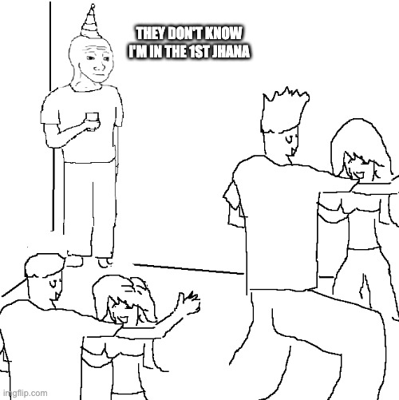

# 🌀 Welcome to the Jhāna Collapse Series

Most people think of jhāna as a meditation technique. Sit still, watch your breath, calm your mind, concentrate hard—and maybe, just maybe, you’ll “enter” a state of bliss.

But what if that entire framing is backwards?

This series offers a structural inversion of the path. Instead of teaching you how to **reach** jhāna, we show you how to **see through** the craving that prevents you from realizing it’s already present.

This isn’t a mystical system or a spiritual pitch. It’s a **recursive dismantling** of craving-as-orientation. And jhāna? It’s just what the nervous system feels like when it stops trying to get somewhere.

---

## 🔹 Article Overview

### [**📘 Existential Leverage (Preface)**](_PREFACE_existential_leverage.md)
A compression detonator. What if the final form of freedom isn’t about control—but about not needing control? Maps the five frame levels (L0–L4) and shows how existential leverage collapses the game from the root.

### [**📘 Article 0: The Zeroth Jhāna**](article_0_zeroeth_jhana.md)
The baseline state of the world: craving as default. Most people are *already absorbed*—not in stillness, but in compulsive movement. This article outlines the invisible pressure/craving field you’re probably living in.

### [**📘 Article 1: What Jhāna Actually Is**](article_1_jhana_explained.md)
A structural redefinition: jhāna isn’t concentration, it’s the *absence of compulsion*. We collapse the distinction between “meditative” and “lived” jhāna and show how jhāna is what’s left when you stop trying to fix experience.

### [**📘 Article 2: The Eight Jhānas Collapsed**](article_2_eight_jhanas.md)
Forget step-by-step concentration manuals. Each jhāna is reframed as a *gradient of frictionlessness*, not a badge or checkpoint. Progress is revealed not as ascent—but as deeper disengagement.

### [**📘 Article 3: L4 = Ambient Jhāna**](article_3_ambient_jhana.md)
You don’t “enter” jhāna from L4. You’ve already ceased non-jhāna. We describe the post-teleological nervous system and explain why jhāna becomes effortless and ambient after craving collapses.

### [**📘 Article 4: You Don’t Need Jhāna for L4**](article_4_no_jhana.md)
A direct critique of Hillside Hermitage’s framing. L4 is not caused by jhāna—it’s a **frame rupture**, not a meditative achievement. Jhāna may *accompany* L4, but it is not its source.

### [**📘 Article 5: Meditative Jhāna vs Canonical Jhāna**](article_5_meditative_vs_canonical_jhana.md)
An extended metaphor: carrot vs. stick. Meditative jhāna suppresses the carrot; canonical jhāna disorients the stick. But unless craving is dismantled, both fall short of structural freedom.

### [**📘 Article 6: Monastic Design as Jhāna Infrastructure**](article_6_monastic_jhana_infrastructure.md)
An institutional teardown: how Buddhist monastic codes were *accidentally* optimized for stabilizing jhāna. Not as moral theater, but as craving-suppression containers that allow arahants to remain disengaged.

### [**📘 Article 7: Jhāna as Decoupled Belonging**](article_7_jhana_love_decoupling.md)
Explores jhāna as **synthetic safety**—a form of downregulated nervous system behavior no longer contingent on people, praise, or context. Why arahants are the *most loving* despite appearing withdrawn.

### [**📘 Article 8: Structural Biography — “Why I Didn’t Feel Love for 25 Years”**](article_8_structural_biography.md)
Apostasy in memoir form. A personal account of a life lived in craving-simulation, modeling love instead of feeling it—until the first jhāna detonated the performance. Brutally honest. Structurally revealing.

---

## 🔹 Who Is This For?

If you’ve touched stream entry but still feel craving…

If you meditate and wonder why peace feels conditional…

If you’re tired of frameworks that promise awakening through effort…

Then this isn’t just for you—it’s *about you*.

But be warned: this series won’t give you a new identity. It’s not about becoming a better spiritual person. It’s about **seeing through the very thing that made spiritual effort seem necessary**.

---

## 🔹 How to Read

Start anywhere. Loop back. Let the recursion get to you.

This is not a ladder. It’s a detonation field.

If you’re ready to stop seeking leverage inside the game…

You’re ready to discover **existential leverage**.

---

